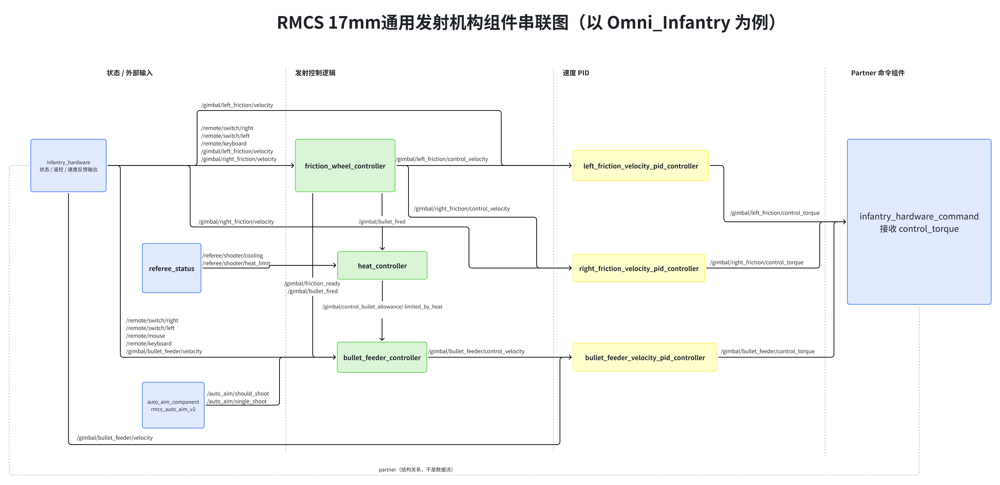
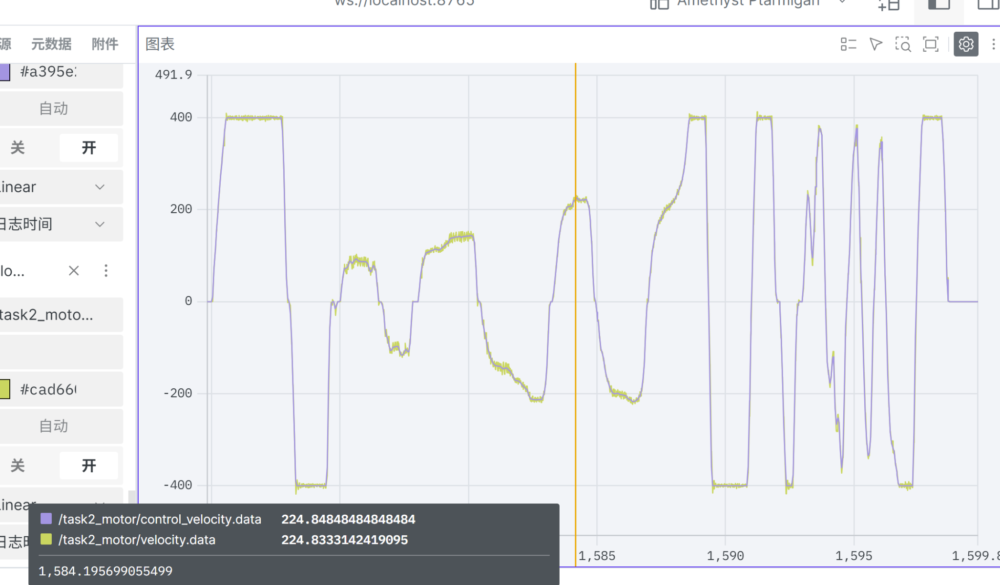
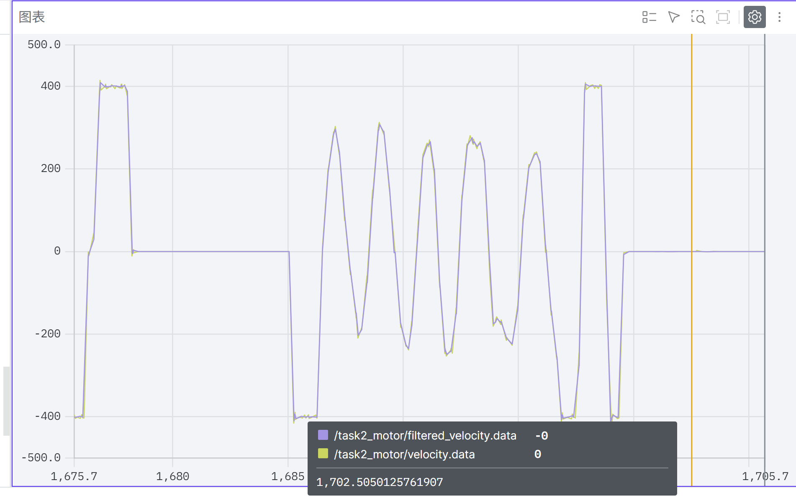
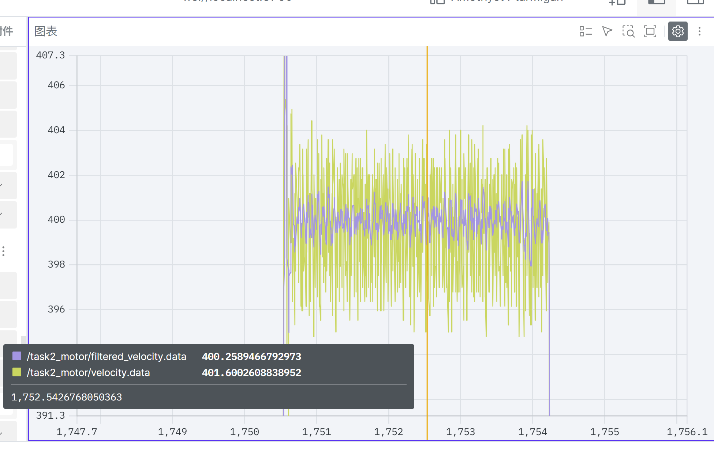
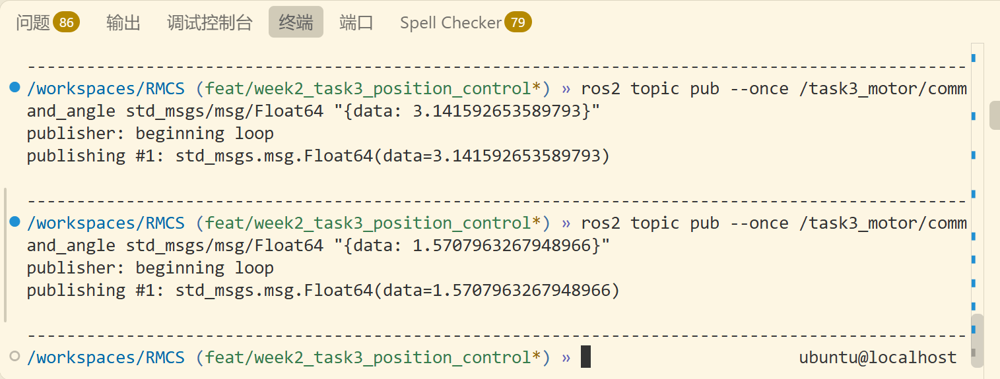
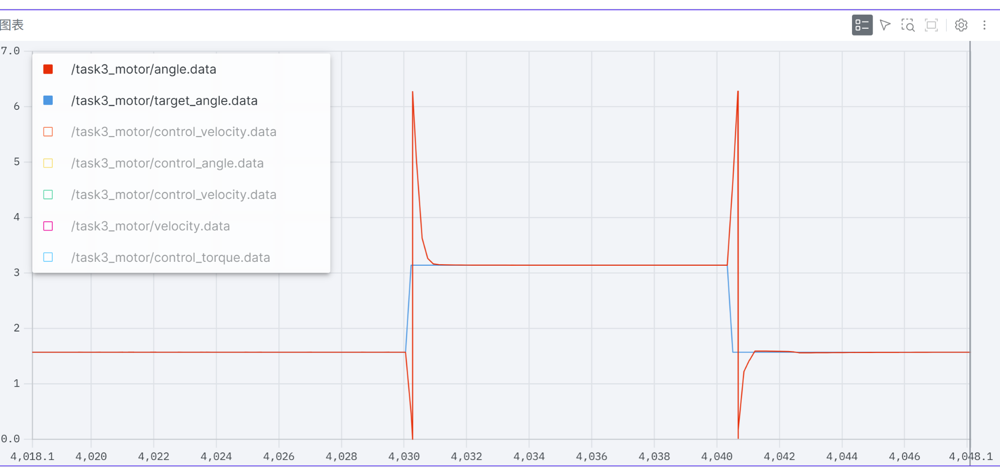
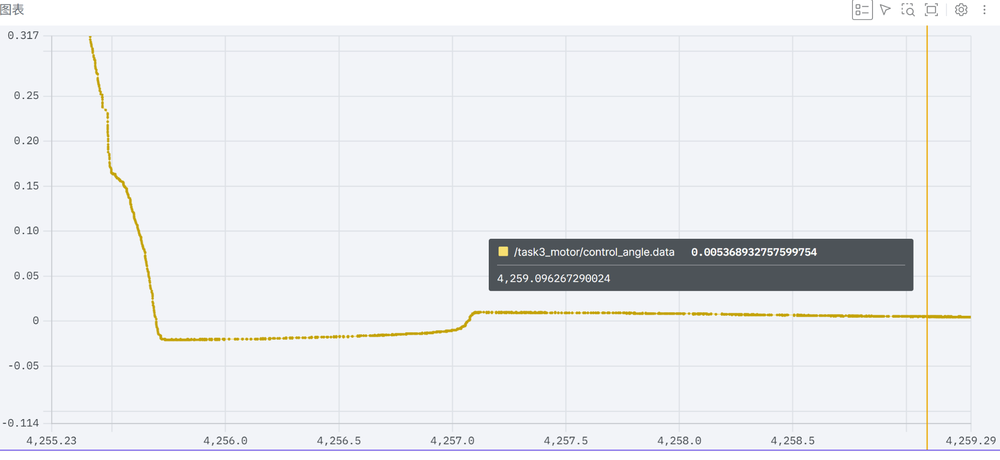

# 第二周作业完成情况

## 任务一：阅读代码与组件串联 ✅

以 OmniInfantry 的 17mm 发射机构为例，阅读相关代码，
梳理摩擦轮控制、热量管理、拨弹控制、速度 PID 与硬件命令
组件之间的输入输出和依赖关系，绘制组件串联图。



## 任务二：使用 RMCS 驱动电机 ✅

### 实现内容

- 编写 M3508 电机硬件组件，接入 DR16 遥控器。
- 将遥控器摇杆映射为目标速度。
- 使用 PID 实现速度闭环控制。
- 对电机速度反馈进行滤波。
- 使用 Foxglove 观察目标速度、实际速度与滤波结果。

### 测试结果

实机测试覆盖正反转、不同目标速度、连续变速及快速切换。
目标速度与实际速度曲线整体高度贴合，在约 ±400 rad/s
保持段也能稳定跟踪，图示测试中未见明显持续振荡，
体现出较好的 PID 速度闭环控制效果。



滤波后反馈保留了整体速度变化趋势。在约 400 rad/s
的保持段，滤波后信号较原始反馈明显更平滑。





### 启动方式

在容器的 rmcs_ws 目录下执行：

    source install/setup.bash
    ros2 launch rmcs_bringup rmcs.launch.py robot:=task2-motor-test

## 任务三：使用双环 PID 控制电机角度 ✅

### 实现内容

- 使用 GM6020 电机，采用角度外环 P、速度内环 PI 控制。
- 通过 ROS2 Topic 接收目标角度，收到一次指令后持续保持目标。
- 使用单圈角度反馈，根据实际运动量更新优弧剩余误差。
- 新目标到来时重新规划优弧行程。
- 相同位置不额外转圈；相差整圈的角度视为等价目标。
- 启动后尚未收到有效目标时，不进行位置控制。

控制流程：

目标角度 → 优弧误差计算 → 角度外环 → 目标速度
→ 速度内环 → 输出力矩 → 电机

### Topic 接口

| Topic | 用途 | 类型 / 单位 |
|---|---|---|
| `/task3_motor/command_angle` | 接收目标角度 | `std_msgs/msg/Float64`，rad |
| `/task3_motor/target_angle` | 目标角度观测 | rad |
| `/task3_motor/angle` | 实际单圈角度 | rad |
| `/task3_motor/control_angle` | 优弧剩余误差 | rad |
| `/task3_motor/control_velocity` | 目标角速度 | rad/s |
| `/task3_motor/velocity` | 实际角速度 | rad/s |
| `/task3_motor/control_torque` | 输出力矩指令 | N·m |

观测数据通过 ValueBroadcaster 发布，在 Foxglove 中使用 `.data` 字段绘图。

### 最终控制参数

控制更新频率：1000 Hz。

| 参数 | 速度内环 | 角度外环 |
|---|---:|---:|
| kp | 0.016 | 8.0 |
| ki | 0.0004 | 0.0 |
| kd | 0.0 | 0.0 |
| 积分累加误差限幅 | ±150 | I 项未启用 |
| 输出限幅 | 未配置软件总输出限幅 | ±10 rad/s |

速度内环积分项最大贡献为：

    0.0004 × 150 = 0.06 N·m

角度外环的 ±10 rad/s 限制作用于目标速度，
实际速度在瞬态过程中仍可能超出该范围。

### 测试结果

通过 Topic 下发 90°、180°、90° 目标角度，完成双向定位测试：

- 90° → 180°：沿负方向运动约 270°。
- 180° → 90°：沿正方向运动约 270°。
- 两次运动均按优弧到达目标附近并保持。
- 单圈反馈跨越 0 / 2π 时会在角度图中跳变，
  剩余误差通过运动增量持续更新。





到位附近存在短暂超调，随后误差逐步修正。
图示末段采样点误差约为 0.00537 rad（0.31°），
未出现持续来回振荡。该数值为本次测试的采样结果，
不代表所有工况下的最大误差。



### 启动与测试命令

启动控制程序：

    source install/setup.bash
    ros2 launch rmcs_bringup rmcs.launch.py robot:=task3_motor_test

在另一个已 source 的容器终端发布 90°：

    ros2 topic pub --once /task3_motor/command_angle std_msgs/msg/Float64 "{data: 1.5707963267948966}"

等待到位后发布 180°：

    ros2 topic pub --once /task3_motor/command_angle std_msgs/msg/Float64 "{data: 3.141592653589793}"

## 测试环境

- Windows + WSL + Docker + VS Code Dev Container
- RMCS / ROS2
- C 板、DR16 遥控器、M3508 与 GM6020 电机
- Foxglove 可视化，比较曲线统一使用日志时间


# RMCS
RoboMaster Control System based on ROS2.

快速开始: [quick-start](https://github.com/Alliance-Algorithm/RMCS/wiki/Quick-Start)

## Development

### Pre-requirements:

- x86-64 架构
- 任意 Linux 发行版，或 WSL2（参见 [WSL2开发指南](docs/zh-cn/wsl2_develop_guide.md)）
- [VSCode](https://code.visualstudio.com/)，安装 [Dev Containers 扩展](https://marketplace.visualstudio.com/items?itemName=ms-vscode-remote.remote-containers)
- [安装 Docker 并 配置代理（部分国家或地区）](docs/zh-cn/docker_with_proxy.md)

### Step 1：获取镜像

下载开发镜像：
```bash
docker pull qzhhhi/rmcs-develop:latest
```

如需交叉编译环境，可下载：
```bash
docker pull qzhhhi/rmcs-develop:latest-full
```

也可自行使用 `Dockerfile` 构建，参见 [镜像构建指南](docs/zh-cn/build_docker_image.md)。

### Step 2：克隆并打开仓库

克隆仓库，注意需要使用 `recurse-submodules` 以克隆子模块：

```bash
git clone --recurse-submodules https://github.com/Alliance-Algorithm/RMCS.git
```

在 VSCode 中打开仓库：

```bash
code ./RMCS
```

按 `Ctrl+Shift+P`，在弹出的菜单中选择 `Dev Containers: Reopen in Container`。

VSCode 将拉起一个 `Docker` 容器，容器中已配置好完整开发环境，之后所有工作将在容器内进行。

如果 `Dev Containers` 在启动时卡住很长一段时间，可以尝试 [这个解决方案](docs/zh-cn/fix_devcontainer_stuck.md)。

### Step 3：配置 VSCode

在 VSCode 中新建终端，输入：

```bash
cp .vscode/settings.default.json .vscode/settings.json
```

这会应用我们推荐的 VSCode 配置文件，你也可以按需自行修改配置文件。

在拓展列表中，可以看到我们推荐使用的拓展正在安装，你也可以按需自行删减拓展。

### Step 4：构建

在 VSCode 终端中输入：

```bash
build-rmcs
```

将会运行 `.script/build-rmcs` 脚本，在路径 `rmcs_ws` 下开始构建代码。

构建完毕后，基于 `clangd` 的 `C++` 代码提示将可用。此时可以正常编写代码。

Note: 用于开发的所有脚本均位于 `.script` 中，参见 开发脚本手册(TODO)。

如需在 `latest-full` 中执行交叉编译，请根据当前容器架构选择对向目标：
```bash
build-rmcs-cross --target-arch arm64
```
适用于 `linux/amd64` 的 `latest-full` 变体。

```bash
build-rmcs-cross --target-arch amd64
```
适用于 `linux/arm64` 的 `latest-full` 变体。

详见 [交叉编译使用说明](docs/zh-cn/cross_build.md)。

### Step 5 (Optional)：运行

编写代码并编译完成后，可以使用：

```bash
launch-rmcs
```

在本机上运行代码。在首次运行代码前，需要调用 `set-robot` 脚本设置机器人类型。

#### 确认设备接入

可以使用 `lsusb` 确定 [下位机](https://github.com/Alliance-Algorithm/rmcs_slave) 是否已接入，若已接入，则 `lsusb` 输出类似：

```
Bus 001 Device 004: ID a11c:75f3 Alliance RoboMaster Team. RMCS Slave v2.1.2
```

在 WSL2 下，需要 [使用 usbipd 对设备进行转接](docs/zh-cn/wsl2_develop_guide.md#step-5-optional)。

#### 确认权限正确

在主机（不要在 `docker` 容器）的终端中输入：

```bash
echo 'SUBSYSTEM=="usb", ATTR{idVendor}=="a11c", MODE="0666"' | sudo tee /etc/udev/rules.d/95-rmcs-slave.rules &&
sudo udevadm control --reload-rules &&
sudo udevadm trigger
```

以允许非 root 用户读写 RMCS 下位机，此指令只需执行一次。

## Deployment

### Pre-requirements:

- x86-64 架构
- 任意 Linux 发行版
- [安装 Docker](docs/zh-cn/docker_with_proxy.md#ubuntu-安装-docker)

### Step 1：获取镜像

下载部署镜像：

```bash
docker pull qzhhhi/rmcs-develop:latest
```

如果不方便在 MiniPC 上配置代理，可以在开发机上下载镜像后，使用

```bash
docker save qzhhhi/rmcs-runtime:latest > rmcs-runtime.tar
```

然后使用任意方式（如 scp）将 `rmcs-runtime.tar` 传送到 MiniPC 上，并在其上执行：

```bash
docker load -i rmcs-runtime.tar
```

即获取部署镜像。

### Step 2：启动容器

在 MiniPC 终端中输入：

```bash
docker run -d --restart=always --privileged --network=host -v /dev:/dev qzhhhi/rmcs-runtime:latest
```

即可启动部署镜像，此后镜像将保持开机自启。

### Step 3：远程连接

在开发容器终端中输入：

```bash
set-remote <remote-host>
```

其中，`remote-host` 可以为 MiniPC 的：

1. IPv4 / IPv6 地址 (e.g., 169.254.233.233)

2. IPv4 / IPv6 Link-local 地址 (e.g., fe80::c6d0:e3ff:fed7:ed12%eth0)

3. mDNS 主机名 (e.g., my-sentry.local)

参见 网络配置指南(TODO)。

接下来在开发容器终端中继续输入：

```bash
ssh-remote
```

即可在开发容器中，ssh 连接到远程的部署容器。

**RMCS 的所有代码更新和调试，都基于从开发容器向部署容器的 ssh 连接。**

部署容器会监听 TCP:2022 端口作为 ssh-server 端口，请注意保证端口空闲。

参见 容器设计思想(TODO)。

> Tip: GUI 可以从部署容器中穿出，尝试在 ssh-remote 中打开 rviz2。

### Step 4：同步构建产物

新启动的部署容器内是没有代码的，需要由开发容器上传。

在开发容器中构建完成后，可以执行指令：

```bash
sync-remote
```

这将拉起一个同步进程，自动将开发容器中的构建产物同步到部署容器。

同步进程除非主动使用 `Ctrl+C` 结束，否则不会退出，其会监视所有文件变更，并实时同步到部署容器。

> Tip: 由于 `build-rmcs` 采用 `symlink-install` 方式构建，因此对于配置文件和 .py 文件，直接修改其源文件，无需编译即可触发同步。

### Step 5：重启服务

RMCS 在部署容器中以服务方式启动 (`/etc/init.d/rmcs`)。

确认构建产物同步完毕后（以出现 `Nothing to do` 为标志），进入 `ssh-remote`，输入：

```bash
set-robot <robot-name>
```

设置启动的机器人类型（例如 set-robot sentry）。

接下来继续输入：

```bash
service rmcs restart
```

如果一切正常，其将会输出：

```bash
Successfully stopped RMCS daemon.
Successfully started RMCS daemon.
```

这证明 RMCS 已成功在部署容器中启动，并会随以后的每次容器启动而启动。

接下来可以使用：

```bash
service rmcs attach
```

查看 RMCS 的实时输出。

> 需要注意的是，`service rmcs attach` 本质上是连接到了一个 `GNU screen` 会话，因此任何按键都会被忠实地转发至 RMCS。例如，当键入 `Ctrl+C` 时，RMCS 会接到 `SIGINT`，从而停止运行。
> 
> 如果希望退出对实时输出的查看，可以键入 `Ctrl+A` ，然后按 `D`。
> 
> 如果希望向上翻页，可以键入 `Ctrl+A` ，然后按 `Esc`。
> 
> 更多快捷键组合参见 [Screen Quick Reference](https://gist.github.com/andrimanna/e5379fe6db3af0ecdb1e49e8cfb74d24)。

### Step 6：糖

指令 `ssh-remote` 后可以添加参数，参数内容即为建立链接后立即执行的指令。

例如：

```bash
ssh-remote service rmcs restart
```

可以在开发容器端快速重启部署容器中的 RMCS。

又如：

```bash
ssh-remote service rmcs attach
```

可以在开发容器端快速查看部署容器中 RMCS 的实时输出。

实际上，可以使用指令：

```bash
attach-remote
```

作为前者的替代（其实现就是前者）。

进一步的，还可以使用：

```bash
attach-remote -r
```

作为 `ssh-remote "service rmcs restart && service rmcs attach"` 的替代。

其在重启 RMCS 守护进程后，自动连接显示实时输出。

更进一步的，指令间还可以组合，例如：

```bash
build-rmcs && wait-sync && attach-remote -r
```

可以触发 RMCS 构建，`wait-sync` 等待文件同步完成，接下来重启 RMCS 守护进程后，显示实时输出。
