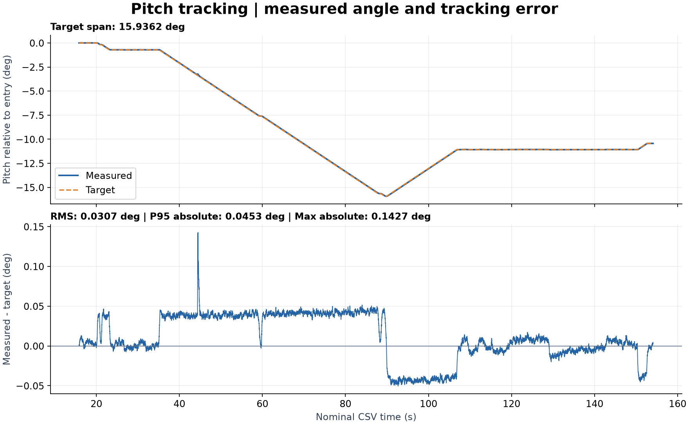
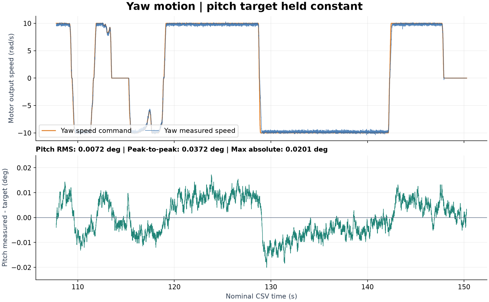
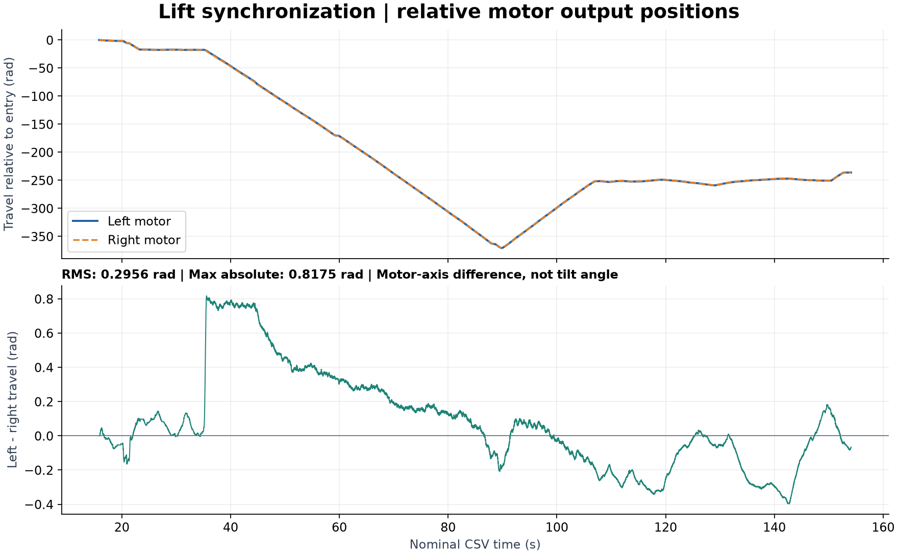

# 龙门架控制任务完成记录

## 1. 任务与完成情况

使用 RMCS 控制系统、C 板、3 组 M2006 电机与 C610 电调、DR16 遥控器，完成发射架 pitch 与 yaw 两个通道的实机控制。左右两台电机协同升降调节 pitch，第三台电机（代码中的 `up_motor`）控制 yaw。

| 任务要求 | 本次实现与实测结果 |
| --- | --- |
| DR16 控制 pitch 和 yaw | 右摇杆上下调整 pitch 目标角，左右控制 yaw 角度；完成实机操作与记录 |
| 升降过程中不得出现明显歪斜 | 实操视频抽帧中未见明显左右歪斜；代码采用回零后的位置同步修正，量化结果见下文 |
| 单独控制 yaw 时 pitch 不变 | 保持 pitch 目标并往返控制 yaw，所选区间 pitch 峰峰波动为 **0.0372°**，表现为小幅波动而非数学上的绝对不变 |
| 实操和代码提交 GitHub | 实操视频、对应数据、控制代码、任务文档及配套曲线图随本次任务一并提交，统一在 main 分支归档 |

## 2. 实操材料与效果

- [实操视频（MP4，约 154.14 秒）](./data/253861e8714d041a6f8393ab7b8f89d1.mp4)
- [对应实验数据（CSV）](./data/gantry_motion_2026-09-21_20-45-21.csv)
- [龙门架控制器](./rmcs_ws/src/rmcs_core/src/controller/gantry_controller.cpp)
- [硬件接口](./rmcs_ws/src/rmcs_core/src/hardware/gantry_control_hardware.cpp)
- [控制参数与采集配置](./rmcs_ws/src/rmcs_bringup/config/gantry_control.yaml)

视频可见遥控操作下机构在不同升降位置运动，后段进行 yaw 调整。抽帧检查中，左右支撑未出现明显的高低分离。对应数据覆盖 pitch 目标变化、目标保持以及 yaw 正反向运动；有效闭环段 pitch 目标角的最大值与最小值相差 **15.9362°**，说明本次记录包含实际角度调节，并非仅静止保持。

视频与 CSV 没有共同时间戳，不能直接用视频秒数定位同一 CSV 样本。下文时间均为 CSV 名义时间，不是视频时间。

## 3. 控制实现与操作方式

1. **动态回零：** 两个拨杆均置上，左右电机分别寻找机械限位。每侧必须先检测到运动，再持续满足低速与力矩条件，才记录该侧多圈角度零点；零点保存在控制器内存中。
2. **pitch 与 yaw 控制：** 回零完成后，左拨杆置上、右拨杆置中。右摇杆上下以最大 `0.005 rad/s` 改变 pitch 目标角，回中后保持目标；右摇杆左右控制 yaw 速度，最大为电机输出轴 `10 rad/s`。
3. **pitch 姿态闭环：** 由于 C 板安装方向，实际使用 `/gantry/imu/roll` 作为 pitch 反馈，处理跨越 ±π 的连续角度。姿态外环采用 PD（`kp=10000`、`kd=1000`），输出左右电机共同速度，再由各电机速度 PD 环输出力矩。
4. **左右同步：** 以回零后的左右多圈位置差 `e_sync=(θL−θL0)−(θR−θR0)` 计算差动速度修正。左侧减去、右侧加上 `clamp(0.1×e_sync, −2, 2) rad/s`，叠加共同速度后各自限幅至 ±`10 rad/s`。
5. **yaw 运动时保持 pitch：** yaw 速度指令独立输出，pitch 姿态闭环和左右同步仍持续工作。因此 yaw 运动产生的 pitch 扰动能够由闭环修正。当前 yaw 为速度控制，没有 yaw 目标角位置闭环，原因是陀螺仪的yaw零漂会导致偏移，不如直接丝杆控制就可以保持不动了。

左右电机速度环和 yaw 速度环均采用 `kp=0.3036926`、`kd=0.009373434`，力矩输出限幅 ±`0.18 N·m`；摇杆死区为 `0.05`。两个拨杆均置中为回零后的同步手动模式；两个拨杆均置下时停止有效控制输出。

## 4. 定量评价

### 4.1 数据口径

控制配置为 `1000 Hz`，每 5 次更新记录一次，名义采样率为 **200 Hz**，使用 `t=index×0.005 s`。CSV 无实测时间戳，因此持续时间按配置估算。

文件有 **32320 行完整样本**（index 0–32319），末尾 index 32320 的记录仅有 16 列，少于表头的 22 列，统计时剔除。pitch 目标与反馈同时有限的闭环样本为 **27656 行**（index 3165–30820，名义时间 15.825–154.100 s）；其余样本不纳入 pitch 误差统计。角度原始单位为 rad，pitch 评价统一乘以 `180/π` 转为度。

定义跟踪误差 `e=(measurement−target)×180/π`；RMS 为 `sqrt(mean(e²))`，P95 为绝对误差的第 95 百分位，峰峰值为区间最大反馈角减最小反馈角。

### 4.2 pitch 跟踪效果



上图以进入闭环时的目标角为零点，展示 pitch 目标与反馈的相对角度；两条曲线基本重合。下图放大反馈减目标的误差，便于观察调节期间的偏差和目标保持时的波动。

| 指标 | 全部有效闭环样本 |
| --- | ---: |
| 样本数 | 27656 |
| 目标角跨度 | 15.9362° |
| 平均有符号误差 | +0.0109° |
| 跟踪误差 RMS | **0.0307°** |
| 绝对误差 P95 | **0.0453°** |
| 最大绝对误差 | **0.1427°** |

在相邻样本目标角变化超过 `1e-10 rad` 的 15136 个样本中，跟踪误差 RMS 为 **0.0410°**。该结果对应本次遥控缓慢调节轨迹，不代表阶跃响应或所有负载下的精度。

### 4.3 单独 yaw 控制时的 pitch 保持



上图展示 yaw 电机速度指令与实测速度，正负切换表示往返运动；下图展示同一时间的 pitch 误差。yaw 多次换向时，pitch 仍在目标附近小幅波动。速度单位为电机输出轴 rad/s，不是发射架 yaw 角速度。

选取 **index 21555–30054**（名义时间 107.775–150.270 s，共 8500 个样本）：该段 pitch 目标保持不变，yaw 指令包含多次正反向运动及换向停顿。

| 指标 | 整个目标保持区间 | 其中 yaw 有效运动指令样本 |
| --- | ---: | ---: |
| 样本数 | 8500 | 7630 |
| 名义样本覆盖时长（样本数 / 200） | 42.50 s | 38.15 s |
| pitch 误差 RMS | 0.0072° | 0.0075° |
| 最大 pitch 绝对误差 | 0.0201° | 0.0201° |
| pitch 反馈峰峰值 | **0.0372°** | **0.0372°** |

有效运动指令样本定义为 `abs(/dart/up_motor/control_velocity)>0.1 rad/s`。本次数据支持“单独 yaw 控制时 pitch 基本保持”的效果描述；这些数值来自板载 IMU 闭环反馈，不是外部仪器标定后的绝对精度。

### 4.4 升降同步性



上图展示左右输出轴相对进入闭环时的位移，两条曲线基本重合；下图单独放大两侧相对位移之差，说明同步偏差仍然存在。图中 rad 表示电机输出轴角度，不表示机构倾角。

CSV 没有记录控制器保存的左右回零值，因此采用进入 pitch 闭环时的 index 3165 为参考，计算左右相对位移差：

`Δθ=(θL−θL,3165)−(θR−θR,3165)`。

| 指标 | 全部有效闭环样本 | pitch 目标变化样本 |
| --- | ---: | ---: |
| 左右相对位移差 RMS | 0.2956 rad | 0.3612 rad |
| 左右相对位移差绝对值 P95 | 0.7552 rad | 0.7684 rad |
| 左右相对位移差最大绝对值 | 0.8175 rad | 0.8175 rad |

同一闭环区间，左、右电机输出轴角度跨度分别为 **370.6867 rad** 和 **370.5036 rad**。上述位移差反映相对初始状态的同步偏差，不等于控制器内部的回零同步误差，也不能直接换算为龙门架倾斜角。数据中缺少将轴角换算为两侧高度差所需的传动参数和支撑间距，因此本次以视频外观评价“无明显歪斜”，以编码器位移差补充量化，不宣称已测得毫米级高度差或倾斜角精度。

### 4.5 复算方法

三组曲线均使用完整有效样本绘制，没有平滑处理。可安装 NumPy、Matplotlib 后，在仓库根目录运行 `python3 docs/gantry/generate_plots.py` 重新生成图片；[绘图脚本](./docs/gantry/generate_plots.py)使用相同的数据筛选口径。

在仓库根目录执行以下 Python 代码（需要 NumPy），可复算主要指标。列通过 CSV 表头名称读取，截断行与无效 pitch 样本按上述口径排除。

```python
import csv
import numpy as np

with open("data/gantry_motion_2026-09-21_20-45-21.csv") as f:
    reader = csv.reader(f)
    header = next(reader)
    rows = [row for row in reader if len(row) == len(header)]
a = np.asarray(rows, dtype=float)
def col(name):
    return a[:, header.index(name)]
def metrics(x):
    return {
        "n": len(x), "RMS": np.sqrt(np.mean(x**2)),
        "P95_abs": np.percentile(np.abs(x), 95),
        "max_abs": np.max(np.abs(x)), "peak_to_peak": np.ptp(x),
    }

index = col("index")
target = col("/gantry/pitch/target")
feedback = col("/gantry/pitch/measurement")
valid = np.isfinite(target) & np.isfinite(feedback)
error = np.rad2deg(feedback - target)
moving = valid & np.r_[False, np.abs(np.diff(target)) > 1e-10]
hold = valid & (index >= 21555) & (index <= 30054)
yaw = hold & (np.abs(col("/dart/up_motor/control_velocity")) > 0.1)
left = col("/dart/left_motor/angle")
right = col("/dart/right_motor/angle")
start = np.flatnonzero(valid)[0]
delta = (left - left[start]) - (right - right[start])
print("pitch 全段（度）", metrics(error[valid]))
print("pitch 目标变化（度）", metrics(error[moving]))
print("目标保持区间（度）", metrics(error[hold]))
print("yaw 运动指令样本（度）", metrics(error[yaw]))
print("同步相对位移差（rad）", metrics(delta[valid]))
print("升降指令变化时同步差（rad）", metrics(delta[moving]))
```
