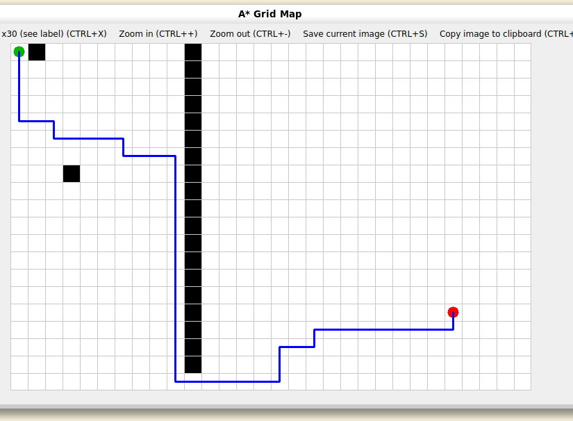

## Week 3 PID 参数选择分析

### 1. 舵轮舵向电机的内环与外环

舵轮舵向电机采用串级控制：

```text
目标舵向角
    ↓
角度外环
    ↓
目标角速度
    ↓
速度内环
    ↓
目标力矩
    ↓
舵向电机
```

舵向电机需要能够在各种条件下快速改变舵向，对响应速度的要求最大,且经常性的变化角度所有在外环使用单p控制输出目标速度，且这个p很大，响应速度理论上很快，同时稳态误差几乎可以忽略不计，所以不使用i项，同时外环产生目标角速度，如果使用d反而会在角度突变的时候引入微分冲击，导致震荡，内环将目标角速度转换为目标力矩输出，目标速度会随着角度误差的减小而变化，所以对稳态误差的感受不明显，反而追求响应速度，同样速度也是经常变化的，所以也不使用i和d，最终就变成使用较硬的p——p双环控制

### 2 摩擦轮

摩擦轮使用pd的速度环控制:


摩擦轮主要是快速升速、发弹掉速后快速恢复、不要产生太大的超调和振荡。理论上对精度有一定的要求，但实际上感觉是速度大加上直驱，转动惯量小，反而是震荡更明显，一点点的稳态误差在大的速度下效果可以忽略，所有会通过较大的p产生主要的力矩，再加入大量的d来抑制震荡，反倒是i在速度上升时容易达到积分限幅，减慢恢复速度

### 3 自瞄云台
自瞄时云台需要追踪动态目标，对精度和响应时间要求很高，所以烧饼为例，云台实际上大部分使用了pi：


这是一个经典的大小yaw的三轴云台，pitch轴和大yaw轴，都是使用双环pi控制，且整个云台的转动惯量大，稳态误差无法忽略，且会对自瞄精度产生较大的影响，所以使用了i项，小yaw轴比较特殊使用外环pid，内环p控制，因为小yaw轴只负责小幅度转动，转动惯量也不大更适合跟踪，控制精度的要求比较高，所以参数基本上比前面两个小。实际上因为i，又加入了很多的积分限幅防止积分过度累计产生震荡


但是pid依旧是有滞后性的，终究是要产生误差才能输出，而目标不会在动一下后等很久才动，要想打到就要提前预测，然后就加入了前馈控制


会对小yaw轴加入一个视觉的前馈来让它能够跟踪目标甚至预测目标的位置提前控制云台运动，大yaw和pitch都有较大的转动惯量所以震荡不明显，不用d，反而在内外环都加入了i项；而小yaw既有前馈有没多的转动惯量，所以加入了d减少震荡，而控制精度又要求很高，所以有i减少误差，内环由于阻力小就只用了p

但是最后pid使用什么还是要根据实际来，效果更好更稳定就使用，理论不完全和实际就相同。

## week 3 双电机龙门架控制方案

### 1. 机构分析

龙门架由左右两个电机分别驱动，通过丝杆或同步机构带动平台升降。

由于左右两侧负载、摩擦以及电机响应存在差异，若仅给两个电机相同的速度指令，可能产生：

- 左右电机运动不同步；
- 两侧累计位置误差；
- 龙门架倾斜；
- 机构卡死或机械损伤。

因此控制系统需要同时考虑：

- 电机速度控制；
- 左右位置同步控制。

---

### 2. 无外部传感器下的姿态估计

当没有额外的倾角传感器时，可以利用两个电机自身编码器估计龙门架姿态，先通过电机低速碰到机械限位后堵转找零，再通过角度多圈累计，以及丝杆参数来确定比例得到pitch。

#### 2.1 机械限位回零

系统启动时，两个电机分别向机械限位方向运动。

通过检测电机状态：

\[
|\omega| < \omega_{threshold}
\]

同时：

\[
|\tau| > \tau_{threshold}
\]

并持续一定时间，可以判断电机已经触碰机械限位。

此时将当前位置设置为零点：

\[
\theta_L=0
\]

\[
\theta_R=0
\]

完成左右电机初始标定。

---

#### 2.2 多圈角度累计

由于升降机构可能需要多圈旋转，单圈编码器角度无法表示实际位置。

因此需要进行多圈角度累计：

\[
\theta_{multi}=N_{turn}\times2\pi+\theta
\]

其中：

- \(N_{turn}\)：累计旋转圈数；
- \(\theta\)：当前编码器角度。

通过多圈角度可以获得电机绝对运动距离。

---

#### 2.3 高度估计

根据丝杆传动关系：

\[
h=k\theta_{multi}
\]

其中：

- \(h\)：实际升降高度；
- \(k\)：电机角度到高度的转换系数。

左右两侧高度分别为：

\[
h_L=k\theta_L
\]

\[
h_R=k\theta_R
\]


因此龙门架左右高度差为：

\[
e_s=h_L-h_R
\]

该误差可以作为龙门架倾斜程度的估计。

---

### 3. 同步控制方案

采用：

**位置同步外环 + 速度内环控制结构**

整体控制框图：

```text
                 目标升降速度

                       |
                       v

              左右高度差计算

                 e_s=h_L-h_R

                       |
                       v

              同步速度补偿

              Δv=K_s e_s

              /             \

             /               \

   左目标速度                 右目标速度

   v_cmd-Δv                   v_cmd+Δv

        |                         |

        v                         v

   左速度PID                 右速度PID

        |                         |

        v                         v

     左电机                    右电机
```

---

同步补偿公式：

\[
v_L=v_{cmd}-K_s e_s
\]


\[
v_R=v_{cmd}+K_s e_s
\]


当：

\[
h_L>h_R
\]

说明左侧高度更高，此时：

- 降低左侧目标速度；
- 增加右侧目标速度；

使左右高度逐渐恢复一致。

---

### 4. 电机速度闭环

左右两个电机分别采用独立速度 PID 控制。

速度误差：

\[
e_v=v_{target}-v_{actual}
\]


控制输出：

\[
u=K_pe_v+K_i\int e_vdt+K_d\frac{de_v}{dt}
\]


其中：

- \(u\)：电机目标力矩；
- \(v_{target}\)：同步控制后得到的目标速度；
- \(v_{actual}\)：编码器反馈速度。

最终分别输出：

\[
u_L
\]

\[
u_R
\]

控制左右电机。

---

### 5. 有外部传感器情况下

如果增加 IMU 等姿态传感器，可以直接测量龙门架倾斜角（或使用光电测距仪获得丝杆的绝对位置进而估计pitch）：

- pitch；
- roll。

控制结构变为：

```text
              IMU

               |

          姿态误差

               |

          同步控制器

               |

       左右电机速度修正

               |

          速度PID

               |

            电机
```

相比仅使用编码器估计：

优点：

- 可以直接获得真实机械姿态；
- 不受丝杆间隙和安装误差影响。

缺点：

- 增加硬件成本；
- 需要进行姿态滤波。

---

### 6. 最终控制结构

最终采用：

```text
目标升降速度

      |

同步位置环
(h_L-h_R)

      |

左右速度补偿

      |

双速度PID

      |

双电机力矩输出
```

该方案利用电机编码器完成无外部传感器情况下的姿态估计，同时通过左右同步控制降低龙门架倾斜误差，提高升降过程稳定性。 

## week 3 opencv轮廓检测
我推测网页可能先将图片灰度化，再提取局部明暗变化，并将变化强弱映射为线稿深浅，之后进行降噪和渐变着色。相比之下，我的实现使用 Canny 和轮廓绘制生成线稿，未保留连续的边缘强度，因此细微纹理的表现有所不同。


模仿网页，我在原有 Canny 轮廓检测的基础上，另用 Sobel 梯度强度生成具有深浅变化的线稿，通过抑制弱响应减少细碎纹理，再根据像素位置添加渐变颜色，得到了更接近示例的效果。


# Week3 A* 栅格寻路

## 任务完成情况

使用 C++ 实现四邻域 A* 算法，以 ROS2 包的形式构建和运行，并使用 OpenCV 显示栅格地图、障碍物、起终点和搜索得到的路径。

## 算法实现

地图使用二维数组存储，0 表示可通行，1 表示障碍物。坐标原点位于左上角，x 向右、y 向下，访问地图时使用 grid[y][x]。

每个节点可以向上、下、左、右移动，每一步代价为 1。A* 使用以下评价函数：

f = g + h

- g：从起点沿当前已发现路径到达节点的累计代价。
- h：节点到终点的曼哈顿距离，即 |x - goal.x| + |y - goal.y|。
- f：用于决定节点的搜索优先级。

程序使用优先队列优先取出 f 较小的节点，通过 g_score 保存到达各格子的最低已知代价。扩展邻居时先检查边界和障碍物，只有发现更短路线才更新代价、记录父节点并加入队列；取出节点时跳过过时记录。

当终点被取出时结束搜索，沿父节点从终点回溯到起点，再反转得到正向路径。若队列耗尽仍未找到终点，则输出 No path found。

## 可视化

- 白色格子：可通行区域。
- 黑色格子：障碍物。
- 绿色圆点：起点。
- 红色圆点：终点。
- 蓝色折线：最终路径。

地图大小为 20 行、30 列，每格显示为 25 × 25 像素。当前将机器人视为占据一个格子的点，未考虑实际车体尺寸和转弯约束。

## 测试结果

测试起点为 (0, 0)，终点为 (25, 15)。

| 场景 | 结果 |
| --- | --- |
| 少量独立障碍物 | 找到路径，代价 40，共 41 个路径点 |
| 列下标 10 设置竖墙，最下面一行留通道 | 从墙底绕行，代价 48，共 49 个路径点 |
| 竖墙贯穿全部行 | 输出 No path found，正常显示地图且不绘制路径 |

默认保留绕墙场景：

```cpp
for (int row = 0; row < rows - 1; ++row) {
    grid[row][10] = 1;
}
```


将循环条件改为 row < rows，重新编译运行，即可复现无解场景。

当前算法以路径步数为优化目标，没有对转弯次数增加惩罚，因此最短路径可能包含多个转弯。


# RMCS
RoboMaster Control System based on ROS2.

快速开始: [quick-start](https://github.com/Alliance-Algorithm/RMCS/wiki/Quick-Start)

## Development

### Pre-requirements:

- x86-64 架构
- 任意 Linux 发行版，或 WSL2（参见 [WSL2开发指南](docs/zh-cn/wsl2_develop_guide.md)）
- [VSCode](https://code.visualstudio.com/)，安装 [Dev Containers 扩展](https://marketplace.visualstudio.com/items?itemName=ms-vscode-remote.remote-containers)
- [安装 Docker 并 配置代理（部分国家或地区）](docs/zh-cn/docker_with_proxy.md)

### Step 1：获取镜像

下载开发镜像：
```bash
docker pull qzhhhi/rmcs-develop:latest
```

如需交叉编译环境，可下载：
```bash
docker pull qzhhhi/rmcs-develop:latest-full
```

也可自行使用 `Dockerfile` 构建，参见 [镜像构建指南](docs/zh-cn/build_docker_image.md)。

### Step 2：克隆并打开仓库

克隆仓库，注意需要使用 `recurse-submodules` 以克隆子模块：

```bash
git clone --recurse-submodules https://github.com/Alliance-Algorithm/RMCS.git
```

在 VSCode 中打开仓库：

```bash
code ./RMCS
```

按 `Ctrl+Shift+P`，在弹出的菜单中选择 `Dev Containers: Reopen in Container`。

VSCode 将拉起一个 `Docker` 容器，容器中已配置好完整开发环境，之后所有工作将在容器内进行。

如果 `Dev Containers` 在启动时卡住很长一段时间，可以尝试 [这个解决方案](docs/zh-cn/fix_devcontainer_stuck.md)。

### Step 3：配置 VSCode

在 VSCode 中新建终端，输入：

```bash
cp .vscode/settings.default.json .vscode/settings.json
```

这会应用我们推荐的 VSCode 配置文件，你也可以按需自行修改配置文件。

在拓展列表中，可以看到我们推荐使用的拓展正在安装，你也可以按需自行删减拓展。

### Step 4：构建

在 VSCode 终端中输入：

```bash
build-rmcs
```

将会运行 `.script/build-rmcs` 脚本，在路径 `rmcs_ws` 下开始构建代码。

构建完毕后，基于 `clangd` 的 `C++` 代码提示将可用。此时可以正常编写代码。

Note: 用于开发的所有脚本均位于 `.script` 中，参见 开发脚本手册(TODO)。

如需在 `latest-full` 中执行交叉编译，请根据当前容器架构选择对向目标：
```bash
build-rmcs-cross --target-arch arm64
```
适用于 `linux/amd64` 的 `latest-full` 变体。

```bash
build-rmcs-cross --target-arch amd64
```
适用于 `linux/arm64` 的 `latest-full` 变体。

详见 [交叉编译使用说明](docs/zh-cn/cross_build.md)。

### Step 5 (Optional)：运行

编写代码并编译完成后，可以使用：

```bash
launch-rmcs
```

在本机上运行代码。在首次运行代码前，需要调用 `set-robot` 脚本设置机器人类型。

#### 确认设备接入

可以使用 `lsusb` 确定 [下位机](https://github.com/Alliance-Algorithm/rmcs_slave) 是否已接入，若已接入，则 `lsusb` 输出类似：

```
Bus 001 Device 004: ID a11c:75f3 Alliance RoboMaster Team. RMCS Slave v2.1.2
```

在 WSL2 下，需要 [使用 usbipd 对设备进行转接](docs/zh-cn/wsl2_develop_guide.md#step-5-optional)。

#### 确认权限正确

在主机（不要在 `docker` 容器）的终端中输入：

```bash
echo 'SUBSYSTEM=="usb", ATTR{idVendor}=="a11c", MODE="0666"' | sudo tee /etc/udev/rules.d/95-rmcs-slave.rules &&
sudo udevadm control --reload-rules &&
sudo udevadm trigger
```

以允许非 root 用户读写 RMCS 下位机，此指令只需执行一次。

## Deployment

### Pre-requirements:

- x86-64 架构
- 任意 Linux 发行版
- [安装 Docker](docs/zh-cn/docker_with_proxy.md#ubuntu-安装-docker)

### Step 1：获取镜像

下载部署镜像：

```bash
docker pull qzhhhi/rmcs-develop:latest
```

如果不方便在 MiniPC 上配置代理，可以在开发机上下载镜像后，使用

```bash
docker save qzhhhi/rmcs-runtime:latest > rmcs-runtime.tar
```

然后使用任意方式（如 scp）将 `rmcs-runtime.tar` 传送到 MiniPC 上，并在其上执行：

```bash
docker load -i rmcs-runtime.tar
```

即获取部署镜像。

### Step 2：启动容器

在 MiniPC 终端中输入：

```bash
docker run -d --restart=always --privileged --network=host -v /dev:/dev qzhhhi/rmcs-runtime:latest
```

即可启动部署镜像，此后镜像将保持开机自启。

### Step 3：远程连接

在开发容器终端中输入：

```bash
set-remote <remote-host>
```

其中，`remote-host` 可以为 MiniPC 的：

1. IPv4 / IPv6 地址 (e.g., 169.254.233.233)

2. IPv4 / IPv6 Link-local 地址 (e.g., fe80::c6d0:e3ff:fed7:ed12%eth0)

3. mDNS 主机名 (e.g., my-sentry.local)

参见 网络配置指南(TODO)。

接下来在开发容器终端中继续输入：

```bash
ssh-remote
```

即可在开发容器中，ssh 连接到远程的部署容器。

**RMCS 的所有代码更新和调试，都基于从开发容器向部署容器的 ssh 连接。**

部署容器会监听 TCP:2022 端口作为 ssh-server 端口，请注意保证端口空闲。

参见 容器设计思想(TODO)。

> Tip: GUI 可以从部署容器中穿出，尝试在 ssh-remote 中打开 rviz2。

### Step 4：同步构建产物

新启动的部署容器内是没有代码的，需要由开发容器上传。

在开发容器中构建完成后，可以执行指令：

```bash
sync-remote
```

这将拉起一个同步进程，自动将开发容器中的构建产物同步到部署容器。

同步进程除非主动使用 `Ctrl+C` 结束，否则不会退出，其会监视所有文件变更，并实时同步到部署容器。

> Tip: 由于 `build-rmcs` 采用 `symlink-install` 方式构建，因此对于配置文件和 .py 文件，直接修改其源文件，无需编译即可触发同步。

### Step 5：重启服务

RMCS 在部署容器中以服务方式启动 (`/etc/init.d/rmcs`)。

确认构建产物同步完毕后（以出现 `Nothing to do` 为标志），进入 `ssh-remote`，输入：

```bash
set-robot <robot-name>
```

设置启动的机器人类型（例如 set-robot sentry）。

接下来继续输入：

```bash
service rmcs restart
```

如果一切正常，其将会输出：

```bash
Successfully stopped RMCS daemon.
Successfully started RMCS daemon.
```

这证明 RMCS 已成功在部署容器中启动，并会随以后的每次容器启动而启动。

接下来可以使用：

```bash
service rmcs attach
```

查看 RMCS 的实时输出。

> 需要注意的是，`service rmcs attach` 本质上是连接到了一个 `GNU screen` 会话，因此任何按键都会被忠实地转发至 RMCS。例如，当键入 `Ctrl+C` 时，RMCS 会接到 `SIGINT`，从而停止运行。
> 
> 如果希望退出对实时输出的查看，可以键入 `Ctrl+A` ，然后按 `D`。
> 
> 如果希望向上翻页，可以键入 `Ctrl+A` ，然后按 `Esc`。
> 
> 更多快捷键组合参见 [Screen Quick Reference](https://gist.github.com/andrimanna/e5379fe6db3af0ecdb1e49e8cfb74d24)。

### Step 6：糖

指令 `ssh-remote` 后可以添加参数，参数内容即为建立链接后立即执行的指令。

例如：

```bash
ssh-remote service rmcs restart
```

可以在开发容器端快速重启部署容器中的 RMCS。

又如：

```bash
ssh-remote service rmcs attach
```

可以在开发容器端快速查看部署容器中 RMCS 的实时输出。

实际上，可以使用指令：

```bash
attach-remote
```

作为前者的替代（其实现就是前者）。

进一步的，还可以使用：

```bash
attach-remote -r
```

作为 `ssh-remote "service rmcs restart && service rmcs attach"` 的替代。

其在重启 RMCS 守护进程后，自动连接显示实时输出。

更进一步的，指令间还可以组合，例如：

```bash
build-rmcs && wait-sync && attach-remote -r
```

可以触发 RMCS 构建，`wait-sync` 等待文件同步完成，接下来重启 RMCS 守护进程后，显示实时输出。
